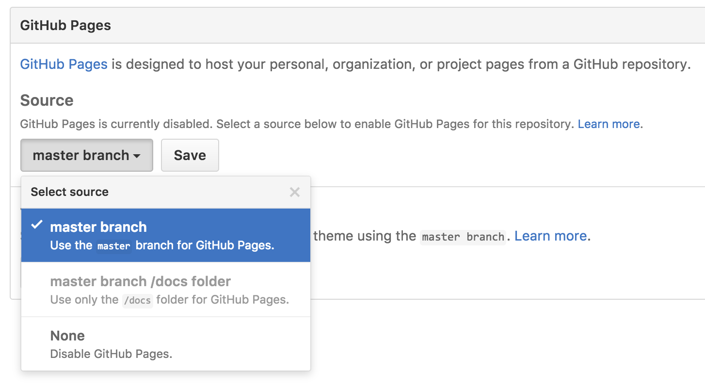

# Project - Interactive Frontend Development

**Project purpose:** Presentation of interactive data for the users.

## Project Description

This project is a single page web application that presents users with 4 choices asking what they feel like doing for the day. Each option, when selected, calls on to an application programming interface (API) service that serves the user with the data required to achieve their selected action goal.

👉 [QUICK PREVIEW](https://kmadjei.github.io/MilestoneProject-InteractiveFrontendDevelopment/)

 
## UX

The project was designed to be used by any body. 

**User's Goal:** To come up with an idea for what to do for the day or in the moment of indecision.

**Site Owner's Goal:** Provide an application to help people generate ideas of what to do for the day.

### Mockup and Wireframes
 
**Mockup**

 

**Wireframes**
- You can find the wireframes [here📺](https://github.com/kmadjei/MilestoneProject-InteractiveFrontendDevelopment/tree/main/assets/images/wireframes)


## Features

### Existing Features
- Home / Landing page - presents users visiting the page with options to choose from
    - Each selection button opens a pop up modal box, serving the users with the data they chose to seek
- The Food option - opens a modal box with recipe, preparation steps, and a video guide for a random food
- The Inspiration option - opens a modal box with a random quote and joke to boost the user's positive energy
- The To Go Out option - opens a modal box that allows user's to look up current weather for their destination
- The Challenge option - opens a modal box with a trivia game for the users to test their knowledge

### Features Left to Implement
- Provide more options to choose from
- Expand on the functionality of the challenge trivia to provide better progress feedback for users

## Technologies Used

- [HTML](https://www.w3schools.com/html/default.asp)
    - **HTML** is used to build the foundational elements for the project.

- [CSS](https://www.w3schools.com/CSS/default.asp)
    - The project uses **CSS** to create visually pleasing content.

- [JavaScript](https://www.w3schools.com/js/default.asp)
    - **JavaScript** is used to provide dynamic contents for the project.

- [JQuery](https://jquery.com)
    - The project uses **JQuery** to simplify DOM manipulation for UX/UI.

- [Font Awesome 5](https://fontawesome.com/)
    - The project uses **Font Awesome** version 5 icons to provide better intuitive user experience.

- [The Mealdb API](https://www.themealdb.com/api.php)
    - The project uses **the Mealdb API** to provides information on a random food, including recipes and preparation steps.

- [FreeQuotes API](https://type.fit/api/quotes)
    - The project uses **FreeQuotes API** to provide inspirational quotes for users.

- [JokesAPI ](https://sv443.net/jokeapi/v2/)
    - The project uses the **Jokes API**  to provide random jokes for users.

- [Open-Weather API](https://openweathermap.org/api)
    - The project uses the **Open-Weather API** to provide current weather forecast for any location users may search for.

- [jService API](https://jservice.io/)
    - The project uses the **jService API** provide trivia questions for users.


## Testing

1.  [Markup Validation Service](https://validator.w3.org/#validate_by_input)
    1. Go to the W3c Markup Validation Site
    2. Copy and paste HTML content for the index.html file to verify there are no errors and warnings

2. [CSS Validation](https://jigsaw.w3.org/css-validator/#validate_by_input)
    1. Go to the W3c CSS Validation Site 
    2. Copy and past the CSS contents for each style sheet on the site validator
    3. Verify no errors were found
        1. Outing.css file returned errors for the `#out-modal .weather`
            1. Corrected font-weight value to 700
            2. Corrected the text-shadow value to ```0 3px rgb(0, 0, 0, 0.4)```
            3. Tested the CSS code again to verify there was no more errors

3. Selection functionality test:
    1. **Food** button
        1. Try selecting the food button and confirm Modal box pops up in the front page
        2. Click on the close button to verify modal box disappears from the screen
        3. Verify content displays data requested from API or indicates error message when food button is clicked
        4. Repeat previous step for the `GET MORE` button
    2. **Inspiration** button
        1. Click on the button to confirm modal box opens and displays in the front of the screen
        2. Click on the close icon to confirm modal box disappears from the screen
        3. Click on the `GET MORE` button to confirm feedback data from API request is successful or failed
        4. Confirm the display of contents when the modal box is open
    3. **To Go Out!** button
        1. Click on the button to confirm modal box opens and displays in the front of the screen
        2. Click on the close icon to confirm modal box disappears from the screen
        3. Try to search for a city like "Toronto, ON" and confirm feedback information for the current weather is displayed for user
        4. Try submitting or hitting the enter key for an empty input and confirm message error for HTTP request
        5. Try submitting an illegal city name and confirm error feedback
    4. **Challenge** button
        1. Click on the button to confirm modal box opens and displays in the front of the screen
        2. Click on the close icon to confirm modal box disappears from the screen
        3. Confirm the modal box is filled with trivia information from the HTTP request
        4. Try submitting an empty for and verify that a validation message for answering the question pops up
        5. Try submitting the right answer, confirm the correct score is updated and user receives feedback for the answer
        6. Try submitting the wrong answer, confirm the incorrect score is updated and user receives feedback for the answer

4. Chrome Dev Tools
    1. Responsive tests:
        1. Open the web application in google chrome 
        2. Right click the web page a select inspection to get access to dev tools
        3. Change the different views of the web application and confirm that the view adapts to different screen sizes
    2. Lighthouse 
        1. Open the lighthouse tool
        2. Select the generate report option for desktop to verify web page performance and list of solutions to improve it

         

        3. Select the generate report option for mobile to verify web page performance and list of solutions to improve it

         


## Deployment

The project is hosted on Github pages after uploading it to Github via Git Bash terminal. 
To  view it 👉 [Click Here](https://kmadjei.github.io/MilestoneProject-InteractiveFrontendDevelopment/)

### Deploying To GitHub Pages

1. To deploy to github, a new repository was created for the application.
2. Make sure to have downloaded [Git Bash](https://www.atlassian.com/git/tutorials/git-bash)
3. Go to the root folder directory of the app on the local computer.
4. Right click it and select ***Git Bash here** to open the terminal.
5. Initialize the project directory by typing ```git init``` in the terminal and pressing the Enter key.
6. Copy the url of the Github repository created for the app.
7. On the terminal add the file to url as a remote with the command 
    ```git remote add origin <paste your github URL here> ```

8. Next, commit all your changes to git with these commands
    ```bash
    git add . 
    git commit -m "Your message here. Example <First commit>"
    ```
9. Create the main branch of your repository with the command ```git branch -M main```
10.  After the steps above,  the project can now be pushed to the repository with the command ```git push```
11. On the github repository of the project, click on the settings

    

12. Within Settings, navigate to the Source section within the Github Pages section.
13.  From the dropdown menu, select master or main branch and then click save.

  

14. Now all the apps can be viewed live at ``` http://<username>.github.io/<repository-name> ```


### Deploy On Your Local PC

1. To deploy the application on your local computer, navigate to the main page of the repository.
2. Above the list of files, click **Code** button


     


3. Select **Download Zip**, to download the zip file to your PC.

     


4. Once the folder is downloaded, you can unzip it and click on the index.html file to deploy it on your local browser.

## Credits

### Media

- The photos used in this site were obtained from:
    - Google images for the [Logo](https://learningthursdays.com/wp-content/uploads/2020/04/What-to-do.jpg )
    - Google image for the [Weather modal box background](https://hdwallpaperim.com/wp-content/uploads/2017/08/23/459518-illustration-Firewatch-video_games-748x468.jpg)
    - Unsplash for the [Inspiration modal box background](https://unsplash.com/photos/RCAUuu9MN2I). Image by Robert Kovacs.

### Acknowledgements

- In order to complete this project I utilized the knowledge I acquired from the [JavaScript Essentials](https://github.com/Code-Institute-Solutions/JS-Essentials-Project/tree/master/13-Tidying%20Up) and [Interactive Frontend](https://github.com/Code-Institute-Solutions/InteractiveFrontendDevelopment-Resume/tree/master/03-SendingEmailsUsingEmailJS/06-sending_emails) walk-through project modules led by Matt Rudge, instructor at The Code Institute.
- I am also grateful for the guidance of Anmar Jarjees, my instructor at the Canadian Business College, for showing with us ways to challenge and improve our skills

**Other resources**

- [How To Create a Modal Box](https://www.w3schools.com/howto/howto_css_modals.asp)
- [5 Fun APIs for Your Next JavaScript Projects](https://javascript.plainenglish.io/5-fun-apis-for-your-next-javascript-projects-1834626864c)
- [Waiting for multiple all API responses to complete with the vanilla JS Promise.all() method](https://gomakethings.com/waiting-for-multiple-all-api-responses-to-complete-with-the-vanilla-js-promise.all-method/)
- [Build a Weather app using HTML, CSS & JavaScript in 2020](https://www.youtube.com/watch?v=n4dtwWgRueI&t=1212s&ab_channel=TylerPotts)
- [Markup Validation Service](https://validator.w3.org/)
- [Chrome DevTools](https://developer.chrome.com/docs/devtools/)
